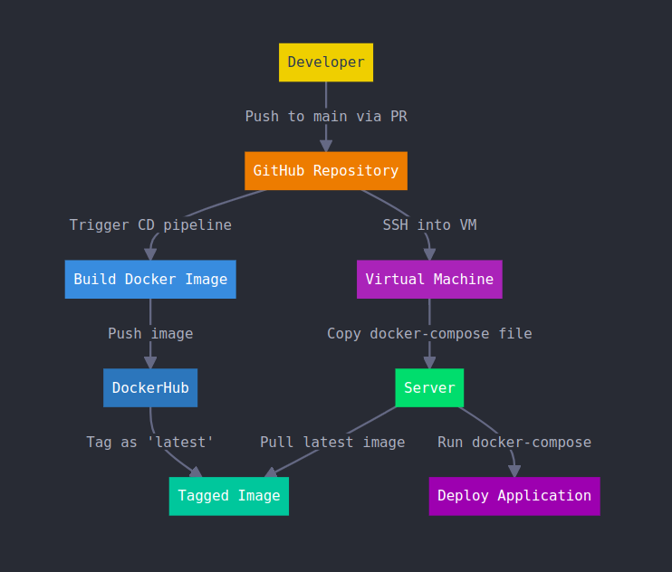

# 🚀 Express Application with Continuous Integration & Deployment 🚀

## Overview
This repository contains the source code for an **Express API** application, enhanced with various DevOps and CI/CD practices. The application has been fully Dockerized, tested, and equipped with code quality checks to ensure maintainability and scalability.

### Key Features:
- **Dockerized Environment**: The entire application is containerized using Docker Compose for consistent development and production environments.
- **Load Balancer**: Distributes incoming traffic across instances, improving performance and scalability.
- **CI Pipeline**: Automated testing, linting, and code analysis with GitHub Actions.
- **CD Pipeline**: Seamless deployments to a remote VM using Docker Hub and Docker Compose.
- **Code Quality Checks**: Integrated with SonarQube and CodeQL for continuous code analysis.
- **Unit Testing**: Ensures component reliability with automated unit tests.

---

## 🐳 Dockerization with Docker Compose
This project uses Docker Compose to manage containerized services, ensuring a consistent environment across development and production:

1. Build the images and start the containers:
   ```bash
   docker-compose up --build
   ```

2. Stop the containers:
   ```bash
   docker-compose down
   ```

The Docker Compose file sets up the **Express API**, database, and other dependencies, making deployment seamless and efficient.

---

## 🌐 Load Balancer Implementation
A load balancer is integrated to efficiently distribute incoming requests across multiple instances of the application. This increases both **scalability** and **performance** during high traffic.

---

## 🔍 Linter CI Check
To maintain high code standards, a **linter** is integrated into the CI pipeline. The linter enforces code best practices and prevents potential issues before merging into the main branch. To run the linter locally:
```bash
npm run lint
```

---

## 📊 Code Quality with SonarQube
SonarQube is used for continuous code quality checks, identifying bugs, code smells, and security vulnerabilities. All commits are automatically analyzed via the CI pipeline, providing valuable insights to maintain a clean and secure codebase.

---

## 🧪 Unit Testing
Unit testing is integrated into the CI pipeline, helping to catch bugs early in the development process and ensure reliability:
- Run the tests locally:
   ```bash
   npm run test
   ```

---

## 🔍 CodeQL Analysis
Advanced code analysis is performed using **CodeQL**, which is integrated into the repository for security vulnerability and quality checks. CodeQL queries the codebase to identify potential issues and ensures best coding practices.

---

## ⚙️ GitHub Actions Workflow
The project leverages **GitHub Actions** to automate the CI pipeline. This workflow includes:
- Linting
- Unit testing
- SonarQube analysis
- CodeQL analysis

The workflow runs on every pull request and ensures that only high-quality code is merged into the main branch.

---

## 🚀 Continuous Deployment (CD) Pipeline
The CD pipeline automates the deployment of the latest code to a remote Virtual Machine (VM). Here’s a summary of the flow:

1. **Pull Request Merged to Main**: When a pull request is merged, the CD pipeline is triggered.
2. **Docker Image Build**: A new Docker image is built from the latest code on the main branch.
3. **Push to Docker Hub**: The image is tagged as 'latest' and pushed to Docker Hub.
4. **SSH into VM**: The pipeline securely SSHs into the target VM.
5. **Docker Compose Deployment**: The Docker Compose file is copied to the server, pulling the latest image from Docker Hub and running the updated application.




This CD pipeline ensures fast, reliable deployments, reducing manual intervention.

---

## 📋 Future Enhancements
The next step is to further refine the CD pipeline and adopt more standard practices to make the deployment process even more efficient and scalable.

---

## 🚀 Getting Started

### Prerequisites:
- Docker
- Node.js
- SonarQube (for local code analysis)

### Installation:
1. Clone the repository:
   ```bash
   git clone https://github.com/your-username/your-repo.git
   ```
2. Install the dependencies:
   ```bash
   npm install
   ```

### Running the Application:
1. Start the application using Docker Compose:
   ```bash
   docker-compose up --build
   ```

2. Access the application on `localhost` (default port: 3000).

---

## 🤝 Contributing
Feel free to open issues and submit pull requests! Contributions are always welcome to improve the project and adopt more DevOps practices.

---

## 📧 Contact
Connect with me on [LinkedIn](https://linkedin.com/in/yourprofile) if you're interested in discussing Docker, CI/CD, or best practices in application development.
